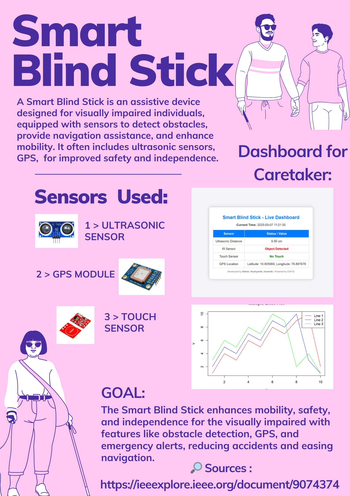

# Smart Blind Stick - IoT Enabled Navigation Aid for Visually Impaired



Welcome to the Smart Blind Stick, an innovative IoT solution designed to empower visually impaired individuals with enhanced navigation and safety. This project integrates sensors, GPS, and cloud connectivity to provide real-time obstacle detection, emergency alerts, and data monitoring through a user-friendly web interface.

---

## 🌟 Features

- **Obstacle Detection**: Uses ultrasonic and IR sensors to detect obstacles, alerting users via a buzzer for distances ≤ 30 cm or nearby objects.
- **Emergency Alerts**: Touch sensor triggers instant email notifications with GPS location and timestamp for immediate assistance.
- **GPS Tracking**: Provides real-time latitude and longitude data, integrated into emergency alerts.
- **Real-Time Dashboard**: A responsive web interface (index.html) displays live sensor data (distance, object detection, touch sensor, location).
- **Historical Data**: View past sensor readings with timestamps on the previous readings page (readings.html).
- **Cloud Integration**: Stores data in Firebase Realtime Database for seamless access and monitoring.
- **Wi-Fi Enabled**: ESP32 hosts a web server for local access and sends data to Firebase.
- **Responsive Design**: Mobile-friendly UI with a collapsible sidebar for screens < 992px.
- **Time Synchronization**: Accurate timestamps using NTP (IST, GMT+5:30).

---

## 📽️ Demo

Watch the Smart Blind Stick in action:

[Watch Demo](Assets/Video.mp4)

---

## 🛠️ Hardware Requirements

- **ESP32 Microcontroller**: For processing and Wi-Fi connectivity.
- **Ultrasonic Sensor (HC-SR04)**: Measures distance to obstacles.
- **IR Sensor**: Detects nearby objects.
- **Touch Sensor**: Triggers emergency alerts.
- **GPS Module (e.g., NEO-6M)**: Provides location data.
- **Buzzer**: Emits audible alerts for obstacles.
- **Wi-Fi Network**: For internet connectivity and Firebase integration.

---
## 💻 Software Requirements

- **Arduino IDE**: To program the ESP32 (final_frontend.ino).
- **Firebase Account**: For Realtime Database to store sensor data.
- **Web Browser**: To access the dashboard and previous readings.
- **Libraries**:

  - WiFi.h
  - TinyGPS++
  - WebServer.h
  - Firebase JavaScript SDK (v9.6.10, recommend upgrading to v10.x.x)

---

## 🚀 Setup Instructions

1. **Hardware Setup**:
   - Connect the ultrasonic sensor (TRIG: Pin 5, ECHO: Pin 18), IR sensor (Pin 4), touch sensor (Pin 15), buzzer (Pin 19), and GPS module (RX: Pin 16, TX: Pin 17) to the ESP32.
   - Ensure a stable power supply for the ESP32 and sensors.

2. **Software Setup**:
   - Install Arduino IDE and required libraries (`WiFi.h`, `TinyGPS++`, `WebServer.h`).
   - Update `upload_to_firebase.ino` with your Wi-Fi credentials (`WIFI_SSID`, `WIFI_PASSWORD`), SMTP details (`SENDER_EMAIL`, `SENDER_PASSWORD`, `RECIPIENT_EMAIL`), and Firebase configuration.
   - Upload `upload_to_firebase.ino` to the ESP32.

3. **Firebase Configuration**:
   - Create a Firebase project and set up a Realtime Database.
   - Update `index.html` and `readings.html` with your Firebase configuration (replace the `firebaseConfig` object).
   - Secure the database with rules (e.g., require authentication).

4. **Web Interface**:
   - Host `index.html`, `readings.html`, and `style.css` on a web server or locally.
   - Access the dashboard at `http://<ESP32_IP_ADDRESS>/` (displayed in the Serial Monitor).
   - View historical data on the previous readings page.

5. **Testing**:
   - Open the Serial Monitor (115200 baud) to verify Wi-Fi connection, sensor readings, and email alerts.
   - Test the web dashboard and previous readings page in a browser.
---

## 📂 Project Structure
```
Smart_Blind_Stick/
├── .github/
│   └── workflows/
│       └── static.yml
├── Assets/
│   ├── Documentation.docx
│   ├── Poster.png
│   └── Video.mp4
├── embedded/
│   ├── configuration.ino
│   └── upload_to_firebase.ino
├── model/
│   └── model.ipynb
└── web-client/
    ├── analytics.html
    ├── index.html
    ├── readings.html
    └── style.css
```
---
## 📄 Documentation

- [📘 Project Report (Word Doc)](Assets/Documentation.docx)


---
## 🤝 Contributing

Contributions are welcome! To contribute, please follow these steps:

1. **Fork** the repository.

2. **Create a new branch**:
   ```
   git checkout -b feature/your-feature
   ```
3. Commit your changes:
```
git commit -m "Add your feature"
```
4. Push to your branch:

```
git push origin feature/your-feature
```
5. Open a Pull Request.
---
## 📜 License

This project is licensed under the [MIT License](LICENSE). You are free to use, modify, and distribute this project with attribution.


---
⭐ Star this repository if you find it helpful!

